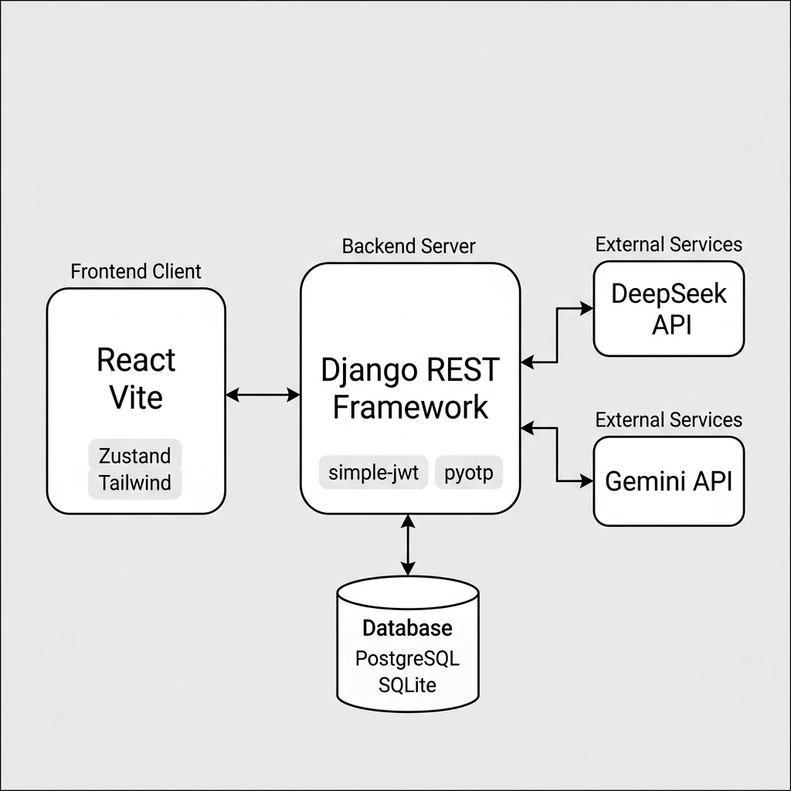

# LebenslaufAI 🇩🇪📄 [](https://github.com/whoiskhairul/lebenslaufAI/actions/workflows/ci.yml)

An AI-powered CV & cover letter tailoring platform. Users maintain a **master profile** (personal info, work experience, projects, skills, education, certifications), paste a job description, and receive **tailored CV versions and cover letters** generated by AI — each tracked against a job application pipeline.

The editor renders a true-to-print, paginated **A4 canvas** with multiple professional templates, inline editing, ATS scoring, and per-section AI polishing. A built-in **admin panel** gives site staff usage metrics, access to every generated CV, user management, and security auditing.

---

## Table of Contents

- [Features](#features)
- [Tech Stack](#tech-stack)
- [Architecture Overview](#architecture-overview)
- [Getting Started](#getting-started)
  - [Prerequisites](#prerequisites)
  - [Backend Setup](#backend-setup)
  - [Frontend Setup](#frontend-setup)
  - [Environment Variables](#environment-variables)
- [Running the App](#running-the-app)
- [Making a Staff User](#making-a-staff-user)
- [API Reference (Summary)](#api-reference-summary)
- [Key Concepts](#key-concepts)
  - [Tailoring Flow](#tailoring-flow)
  - [Rendering & Pagination Pipeline](#rendering--pagination-pipeline)
  - [Admin Panel](#admin-panel)
- [State Management](#state-management)
- [Theming & Styling](#theming--styling)
- [Verification Commands](#verification-commands)
- [Deployment Notes](#deployment-notes)
- [Known Debt / Roadmap](#known-debt--roadmap)

---

## Features

### For users
- 🔐 **Authentication** — email/password with strength checks (zxcvbn), email verification, password reset, brute-force lockout, optional TOTP two-factor auth, social login (Google / GitHub / LinkedIn), session management with device list & revocation
- 📇 **Master Profile** — single source of truth for all CV content: personal info, experiences, projects, skills (grouped by category), education, certifications
- 🤖 **AI Tailoring** — paste a job description; DeepSeek/Gemini produces a tailored CV version + cover letter (English or German, standard/aggressive ATS keyword strategies)
- ✍️ **A4 Canvas Editor** — true 210mm × 297mm pages, automatic pagination with section atomicity, zoom-to-fit, multi-page support
- 🎨 **Templates & Styling** — Pixel Perfect (German-style) layout, font/size/spacing/color controls, density presets, section show/hide/reorder
- 🧠 **Per-section AI polish** — side-by-side review of AI proposals with original/AI version toggling
- 📊 **ATS Dashboard** — live match score, matched/missing keywords, one-click skill injection
- 💼 **Application Tracker** — wishlist → preparing → applied → interview → offer/rejected pipeline linked to tailored CVs
- 🖨️ **Print/PDF export** — browser print with exact A4 page sizing

### For admins (`is_staff`)
- 📈 Usage dashboard — totals, 7/30-day growth, engagement metrics, signup/CV/login charts, template usage, most-active users
- 👥 User management — search/filter, activate/deactivate accounts, grant/revoke staff
- 📄 **CV viewer** — open any user's generated CV + print to PDF
- 💼 Application browser, 🔐 audit-log explorer, active session list

---

## Tech Stack

| Layer | Technology |
|---|---|
| Frontend | React 18, TypeScript, Vite |
| State | Zustand (auth/session + CV document stores) |
| Styling | Tailwind CSS (theme-variable mapped) + CSS Modules |
| Icons | lucide-react |
| HTTP | Axios (single instance, JWT injection + auto-refresh) |
| Backend | Django 4.2, Django REST Framework |
| Auth | djangorestframework-simplejwt (JWT), django-allauth (OAuth), pyotp (2FA) |
| Database | SQLite (dev) / PostgreSQL via `DATABASE_URL` |
| AI | DeepSeek API/Gemini API (`backend/services/ai_service.py`) |
| Other | django-cors-headers, whitenoise, gunicorn, pypdf, Pillow |

---
## Architecture Overview



*Layered view of the codebase: frontend presentation → feature logic & state → data access, across the transport boundary into Django routing → API endpoints → serializers → domain services → models → database. Each layer lists the actual files/modules that live there.*

### Backend apps

| App | Responsibility |
|---|---|
| `core` | Settings + URL registry (everything under `/api/v1/*`) |
| `users` | Custom UUID `User`, `UserProfile`, `UserSession`, `AuthAuditLog`; auth views, 2FA, sessions, OAuth |
| `master_profile` | Source-of-truth CV content: `PersonalInfo`, `WorkExperience`, `Project`, `Skill`, `Education`, `Certification` |
| `resume` | `ResumeVersion` (tailored snapshot incl. `original_profile` + AI overrides), `CoverLetterVersion` |
| `applications` | Job application tracker with status history |
| `admin_panel` | Staff-only APIs: metrics aggregation, user management, all CVs/applications/logs/sessions |

### Frontend feature folders

```
frontend/src/
├── App.tsx                    # lightweight router (path → view, auth-gated)
├── components/AppShell.tsx    # sidebar / mobile bottom nav shell
├── store/authStore.ts         # tokens, user, theme, UI state (Zustand)
├── services/api.ts            # axios instance (JWT inject + auto-refresh)
│
├── features/
│   ├── admin/                 # AdminPanel shell + tabs/, components/, hooks/, cv/
│   └── editor/
│       ├── state/cvDocumentStore.ts  # sections, editable grids, styles
│       ├── hooks/             # useCvPagination, useCanvasZoom, useSectionOps
│       ├── panels/            # TailorPanel, StyleControlsPanel
│       └── utils/parsedLetter.ts
│
├── views/
│   ├── EditorNew.tsx          # editor orchestrator (canvas, letter page, modals)
│   ├── Dashboard.tsx / MasterProfile.tsx / Settings.tsx / Landing.tsx
│   ├── auth/                  # Login, Register, AccountSecurity
│   └── editor/
│       ├── components/
│       │   ├── UnitRenderer.tsx        # dispatcher (~170 lines)
│       │   └── unitRenderers/          # HeaderUnit, ExperienceItemUnit, …
│       └── utils/                      # date / phone / title formatters
│
├── views/editorStyles.ts      # merges base + template CSS modules
├── views/EditorNew.module.css # shared/base styles
├── views/EditorNewPixelPerfect.module.css
└── views/EditorNewGerman.module.css
```

---

## Getting Started

### Prerequisites

| Tool | Version |
|---|---|
| Python | 3.11+ recommended |
| Node.js | 18+ |
| npm | 9+ |

### Backend Setup

```bash
cd backend

# create & activate a virtual environment
python -m venv venv
venv\Scripts\activate          # Windows
# source venv/bin/activate     # macOS/Linux

pip install -r requirements.txt

# environment (copy the root example configuration into backend/)
cp ../.env.example .env        # then fill in values (see below)

python manage.py migrate
```

The dev database is SQLite (`backend/db.sqlite3`) out of the box. Set `DATABASE_URL` for PostgreSQL.

### Frontend Setup

```bash
cd frontend
npm install
```

Create `frontend/.env`:

```env
VITE_API_URL=http://localhost:8000/api/v1
VITE_GOOGLE_CLIENT_ID=<google oauth client id>
```

### Environment Variables

Root `.env` (consumed by Django via python-dotenv):

| Variable | Purpose |
|---|---|
| `SECRET_KEY` | Django secret key |
| `DEBUG` | `True` for development |
| `ALLOWED_HOSTS` | Comma-separated hosts |
| `DEEPSEEK_API_KEY` | **Required for AI tailoring** |
| `DATABASE_URL` | Optional PostgreSQL URL (SQLite fallback) |
| `FRONTEND_URL` | Used in verification emails (default `http://localhost:5173`) |
| `CORS_ALLOWED_ORIGINS` | Comma-separated origins (defaults allow-all in DEBUG) |
| `GOOGLE_CLIENT_ID` / `GOOGLE_CLIENT_SECRET` | Google OAuth via allauth |
| `GITHUB_CLIENT_ID` / `GITHUB_CLIENT_SECRET` | GitHub OAuth |
| `LINKEDIN_CLIENT_ID` / `LINKEDIN_CLIENT_SECRET` | LinkedIn OAuth |

---

## Running the App

Remember to activate the Python virtual environment in your backend terminal.

```bash
# Terminal 1 — backend (http://localhost:8000)
cd backend
# Windows: venv\Scripts\activate | macOS/Linux: source venv/bin/activate
venv\Scripts\activate
python manage.py runserver

# Terminal 2 — frontend (http://localhost:5173)
cd frontend && npm run dev
```

Production build:

```bash
cd frontend && npm run build   # tsc typecheck + vite bundle → dist/
```

Django also exposes its built-in admin panel at [http://localhost:8000/admin/](http://localhost:8000/admin/) (superuser only).

## Making a Staff User

The in-app Admin Panel requires `is_staff`:

```bash
cd backend
python manage.py shell -c "from users.models import User; u=User.objects.get(email='you@example.com'); u.is_staff=True; u.save()"
```

---

## API Reference (Summary)

All endpoints are prefixed with `/api/v1` and require a Bearer token unless noted.

### Auth (`users.urls`, mounted at `/api/v1/auth/*` and `/api/v1/users/*`)
| Endpoint | Method | Notes |
|---|---|---|
| `/auth/register` | POST | Public; sends verification email |
| `/auth/verify-email` · `/auth/resend-verification` | POST | Public |
| `/auth/login` | POST | Returns `{access, refresh, user, session_key}`; supports 2FA step-up |
| `/auth/refresh` | POST | SimpleJWT rotation |
| `/auth/logout` · `/auth/password-change` | POST | |
| `/auth/password-reset` · `/auth/password-reset-confirm` | POST | Public |
| `/auth/social-login` · `/auth/social-<provider>` | POST/GET | Google / GitHub / LinkedIn |
| `/security/2fa/setup` · `/verify` · `/disable` | POST | TOTP |
| `/security/sessions` (+ `/revoke`) | GET/POST | Device sessions |
| `/account/profile` · `/account/delete` | GET·PUT/DELETE | |

### Master profile — `/api/v1/master-profile/…`
Personal info, work experiences, projects, skills, educations, certifications + `/full` aggregate endpoint.

### Resume — `/api/v1/resume/…`
| Endpoint | Method | Purpose |
|---|---|---|
| `/resume/tailor` | POST | Generate a tailored CV from job description |
| `/resume/versions` | GET/POST | List/create versions |
| `/resume/versions/{id}` | PATCH | Update a version |
| `/resume/cover-letter` | POST | Generate cover letter |
| `/resume/letters` | GET | List cover letters |
| `/resume/ats/score` · `/ats/optimize` · `/rephrase` | POST | ATS scoring, optimization, AI rephrase |

### Applications — `/api/v1/applications` (CRUD + status pipeline)

### Admin — `/api/v1/admin/*` (**staff only**, `IsAdminUser`)
| Endpoint | Method | Purpose |
|---|---|---|
| `/admin/metrics` | GET | Aggregated platform metrics + time series |
| `/admin/users` · `/admin/users/{id}` | GET / PATCH | Searchable user list w/ usage counts; detail; activate/staff toggles |
| `/admin/resumes` | GET | All generated CVs (search, template filter, ATS ordering) |
| `/admin/resumes/{id}` | GET | Full CV payload (incl. `tailored_details`) for A4 viewer |
| `/admin/applications` · `/admin/cover-letters` | GET | Cross-user listings |
| `/admin/audit-logs` · `/admin/sessions` | GET | Security events, active sessions |

---

## Key Concepts

### Tailoring flow

```
Master Profile ──► POST /resume/tailor (job description + cv_details)
                          │
                          ▼
               DeepSeek generates overrides
                          ▼
   ResumeVersion = original_profile snapshot + per-field overrides
                          ▼
Editor flattens overrides onto profile ──► editable* grids (Zustand store)
```

A `ResumeVersion.tailored_details` contains **both** the master-profile snapshot taken at tailor-time *and* the AI's per-field changes. This makes every version self-contained — which is exactly why the admin panel can render any historical CV without touching live profiles.

### Rendering & pagination pipeline

The heart of the editor — and reused by the admin CV viewer:

```
editable* grids (Zustand cvDocumentStore)
   │
   ├─► HIDDEN measuring canvas  (MeasuringContext=true → static divs,
   │    absolute-positioned off-screen, 210mm wide)
   │        └── getBoundingClientRect() per [data-measuring-id]
   │
   ├─► useCvPagination — flat unit stream greedily packed into A4 pages
   │    (1123px content height, section atomicity, creative_tech
   │    split-column height budgets)
   │
   └─► Visible pages — UnitRenderer dispatches each RenderableUnit to a
        branch component (HeaderUnit, ExperienceItemUnit, …), styled by
        template class, scaled by useCanvasZoom
```

- `UnitRenderer.tsx` is a thin dispatcher; each block type lives in `unitRenderers/`
- Templates map to standalone CSS modules merged through `views/editorStyles.ts`
- The admin viewer calls `prepareCvData()` on a stored version and feeds the same renderer — pixel-identical output, plus print-to-PDF via dedicated `@media print` rules

### Admin Panel

- Client-side: `AppShell` shows an "Admin" nav item only for staff; the route is blocked otherwise
- Server-side: every `/api/v1/admin/*` view requires `IsAdminUser`
- Tabs: **Overview** (metrics + charts) · **Users** (manage) · **CVs** (list + full A4 viewer) · **Applications** · **Security** (audit logs + sessions)

---

## State Management

Two Zustand stores, deliberately separate:

| Store | Scope | Contents |
|---|---|---|
| `authStore` | Session-wide | Tokens, user, theme, sidebar/mobile-pane state |
| `cvDocumentStore` | One editing session | `sections`, `editablePersonalInfo`, `editableExperiences/Projects/Educations/Skills`, `customStyles`, `headerStyles`, `template`, skill ordering |

Both expose setters matching React's `Dispatch<SetStateAction<T>>` contract, so handler code reads identically whether state is local or shared. `resetDocument()` runs on editor mount so every visit starts clean.

---

## Theming & Styling

- Design tokens as CSS variables (`--primary`, `--card-bg`, `--muted`…) switched via `[data-theme="dark"|"light"]`
- Tailwind colors map onto those variables (`text-muted`, `bg-card`, `border-cardline`…)
- Layout/components use CSS Modules; template-specific styles are isolated in their own modules (`PixelPerfect`, `German`) to keep files manageable
- Fonts: Space Grotesk (headers) / Inter (body); `.no-print` and `@media print` rules guarantee clean PDF output

---

## Verification Commands

```bash
# Backend
cd backend && python manage.py check

# Frontend — types + production build
cd frontend && npx tsc --noEmit
cd frontend && npm run build
```

---

## Deployment Notes

- **Backend:** gunicorn + whitenoise are already in requirements; set `DATABASE_URL`, `SECRET_KEY`, `DEBUG=False`, `ALLOWED_HOSTS`, `CORS_ALLOWED_ORIGINS`, `DEEPSEEK_API_KEY` in the host environment. Run `python manage.py migrate` on release.
- **Frontend:** `npm run build` produces static assets in `dist/`; serve from any static host/CDN and point `VITE_API_URL` at the API.
- The backend allows `.vercel.app` domains by default in `ALLOWED_HOSTS` to support hosting the frontend on Vercel.

---

## Known Debt / Roadmap

- [ ] `views/EditorNew.tsx` (~3.3k lines): Cover Letter page editor, AI-polish modals and panel-resizing logic are still inline — same extraction pattern as the existing panels applies
- [ ] Remaining base CSS module could be partitioned further (same pattern as the template modules)
- [ ] No automated tests yet — add Playwright smoke coverage for tailor → edit → print flow
- [ ] Cover-letter templates are currently a single German-format layout
